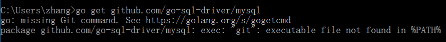
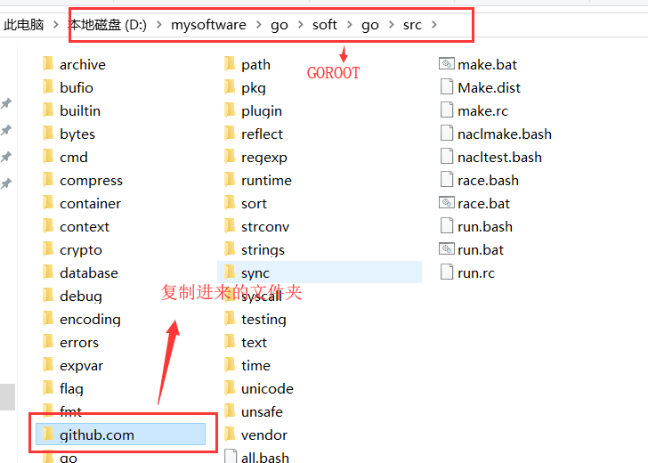
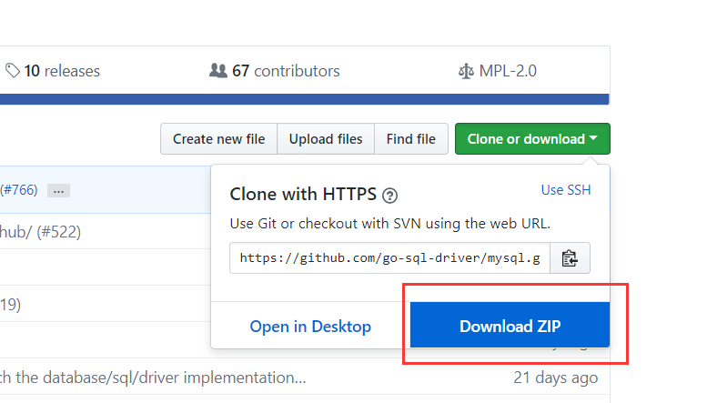

# 一.驱动包简介

* 驱动包:任何编程语言想要连接数据库必须由数据库生产厂商提供了统一数据库调用而开发的内容
* Golang的MySQL驱动包可以在github中下载到
> http://github.com/go-sql-driver/mysql
# 二.go get

* go get命令可以远程下载指定内容,支持git
* github要求下载内容必须通过git客户端,所以当直接使用go get命令后会提示错误
* 在命令行中运行命令
  * 需要注意的是:前提已经安装好git客户端(安装包已经放在02资料中)
> go get github.com/go-sql-driver/mysql
* 如果没有安装git客户端会出现下面错误信息
  

* 安装了git后运行命令会自动下载到%GOPATH%/src中
  * 处一定注意:安装了git后必须重新打开命令行,否者git环境变量不生效 

* 进入src把内容复制到%GOROOT%/src中

  * 由于环境变量中GOPATH可能与Goland中配置的GOPATH不同,所以此处建议放入到%GOROOT%/src中,这样可以保证切换GOPATH也可以加载到驱动包

* 复制完效果如下
  

# 三.手动下载配置
* 如果不希望安装git也可以手动下载,进入网址
> http://github.com/go-sql-driver/mysql
* 点击右侧”Download ZIP”
  
* 在%GOROOT%/src下新建3级文件夹`github.com/go-sql-driver/mysql`,把ZIP解压后mysql-master里面全部代码放入到mysql(`github.com/go-sql-driver/mysql`)文件夹中