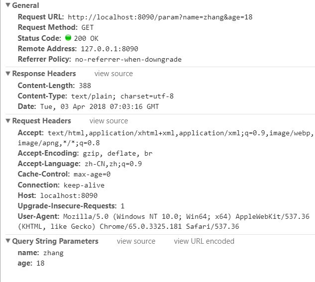

1、map切片内容可以通过for循环取出

2、好像很多东西都是map

3、

```go
package main 

import "fmt"
import "net/http"

func param(res http.ResponseWriter, req *http.Request) {
   fmt.Fprintln(res, "第一个")
   //req.Header中Header本质是:type Header map[string][]string
   header:=req.Header
   fmt.Fprintln(res,"Header全部数据:",header)	//输出全部请求头
   //为了让各位同学便读写代码,刻意明确给定类型
   var acc []string =header["Accept"]
   for _,n:=range acc{
      fmt.Fprintln(res,"Accepth内容:",n)	//ctrl看参数
   }
}

func main() {
   server := http.Server{
      Addr: "localhost:8090",
   }
   http.HandleFunc("/param", param)
   server.ListenAndServe()
}
```


# 一.获取请求头

* 在浏览器地址栏中输入下面信息,这属于http请求的get方式,请求携带两个参数
```
http://localhost:8090/param?name=zhang&age=18
```
* 下面是谷歌浏览器开发者工具(F12)观察到的信息
  
* 可以使用http.Request.Header获取请求(Request Headers信息)
```go
package main 

import "fmt"
import "net/http"

func param(res http.ResponseWriter, req *http.Request) {
   fmt.Fprintln(res, "第一个")
   //req.Header中Header本质是:type Header map[string][]string
   header:=req.Header
   fmt.Fprintln(res,"Header全部数据:",header)	//输出全部请求头
   //为了让各位同学便读写代码,刻意明确给定类型
   var acc []string =header["Accept"]
   for _,n:=range acc{
      fmt.Fprintln(res,"Accepth内容:",n)	//ctrl看参数
   }
}

func main() {
   server := http.Server{
      Addr: "localhost:8090",
   }
   http.HandleFunc("/param", param)
   server.ListenAndServe()
}
```
# 二. 获取请求参数

* 请求参数可以一次全部获取也可以按照名称获取
```go
package main

import "fmt"
import "net/http"

func param(res http.ResponseWriter, req *http.Request) {
	req.ParseForm()
	fmt.Fprintln(res,req.Form)
	/*
	按照请求参数名获取参数值
	根据源码,FormValue(key)=req.Form[key]
	 */
	name:=req.FormValue("name")
	age:=req.FormValue("age")
	fmt.Fprintln(res,name,age)
}

func main() {
	server := http.Server{
		Addr: "localhost:8090",
	}
	http.HandleFunc("/param", param)
	server.ListenAndServe()
}
```