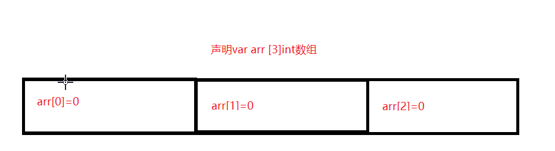

# 一.数组介绍

* 数组:具有固定长度相同类型元素序列
* 声明数组的语法
```go
	//var 对象名 [长度]元素类型
	var arr [5]int
	fmt.Println(arr) //输出:[0 0 0 0 0]
```
* 数组就是内存中一段固定长度的连续空间.
* 声明数组后数组就会在内存中开辟一块连续空间,每个值称为数组的元素,且元素值为类型对应的默认值.例如int类型默认值为0,string类型默认值为空字符串
* 数组中每个元素按照顺序都有自己整数类型的脚标,脚标从第一个元素为0向后依次加1
  
* 数组中实际开发中主要作用是充当临时容器,因为声明一个数组变量比声明多个相同类型变量在操作时更加方便
# 二.数组的创建和赋值

* 可以在声明数组时可以同时给数组赋值,赋值时要求长度必须大于等于初始值个数
```go
	//方式一:完整写法
	var arr [3]int = [3]int{1, 2, 3}
	//方式二:短变量方式
	arr2 := [3]int{1, 2, 3}
	//方式三:长度大于初始值个数.长度为4,只给前三个元素赋值,其余元素为默认值
	arr3 := [4]int{1, 2, 3}
	//方式四:赋值时不写长度,数组长度根据元素个数确定
	arr4 := [...]int{1, 2, 3}
```
* 可以通过:**数组名[脚标]**对数组中元素进行操作
```go
	arr := [3]int{1, 2, 3}

	fmt.Println(arr)
	//通过脚标对数组中元素进行重新赋值
	arr[0] = 5
	arr[1] = 6
	arr[2] = 7
	fmt.Println(arr[0], arr[1], arr[2])
```
* 通过len(数组变量)获取数组长度,数组脚标最大值为长度减一,如果超出这个范围将会报错
```go
	arr := [3]int{1, 2, 3}
	fmt.Println(len(arr))//输出:3
	arr[3]=5//错误信息:invalid array index 3 (out of bounds for 3-element array)
```
# 三.数组是值类型
* 在Go语言中数组是值类型,和之前学习的int或float64等类型相同,把一个数组变量赋值给另一个数组变量时为复制副本,重新开辟一块空间
* 使用==比较数组中值是否相等
```go
	arr := [3]int{1, 2, 3}
	arr2:=arr
	fmt.Println(arr,arr2)
	fmt.Printf("%p %p",&arr,&arr2)//地址不同
	fmt.Println(arr==arr2)
```

