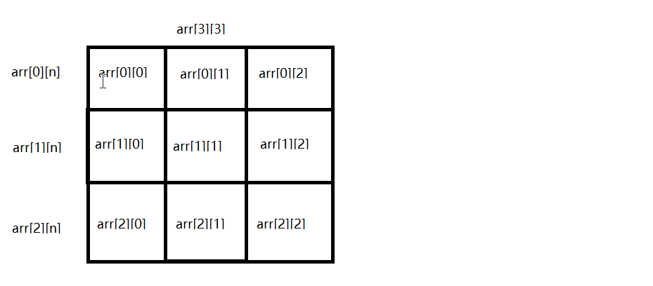

！！

1、int类型的一维数组

2、三维数组可以理解成,一维数组中每个元素都是二维数组


# 一.二维数组

* 二维数组表示一个数组变量中每个元素又是一个数组变量
* 声明二维数组的语法
```
var arr [n][m]int
```

* 使用 arr[n]时返回一个 arr[m]类型的数组
* 图示
  

# 二.二维数组的使用
* 声明并创建二维数组
```go
	//写在同一行,最后一个元素后面不需要有逗号
	//arr6:=[3][3]int{{1,2,3},{4,5,6},{7,8,9}}
	arr := [3][3]int{
		{1, 2, 3},
		{4, 5, 6},
		{7, 8, 9}, //每个元素分行写,最后一个必须有逗号
	}
	arr0 := arr[0]
	fmt.Println(arr0[0], arr0[1], arr[2])
	//上面等效于下面的写法.习惯上多下下面的方式
	fmt.Println(arr[0][0], arr[0][1], arr[0][2])
```
# 三.多维数组

* 理论上支持无限多维数组(只要内存够用)
* 三维数组可以理解成,一维数组中每个元素都是二维数组.四维数组理解成,一个一维数组中每个元素都是三维数组
* 无论是几维数组,都符号元素类型是相同的
* 实际开发中多维数组使用并不多,在一定程度上,程序员使用多维数组很容易出错
```go
	arr := [2][2][2]int{
		{
			{1, 2},
			{3, 4},
		},
		{
			{5, 6},
			{7, 8},
		},
	}
	fmt.Println(arr)
	//几维数组在操作元素时,数组变量后面就有几个[]
	fmt.Println(arr[0][1][1])
```

