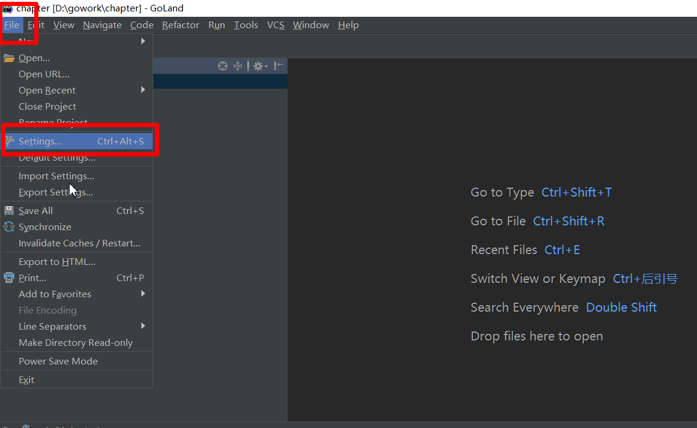
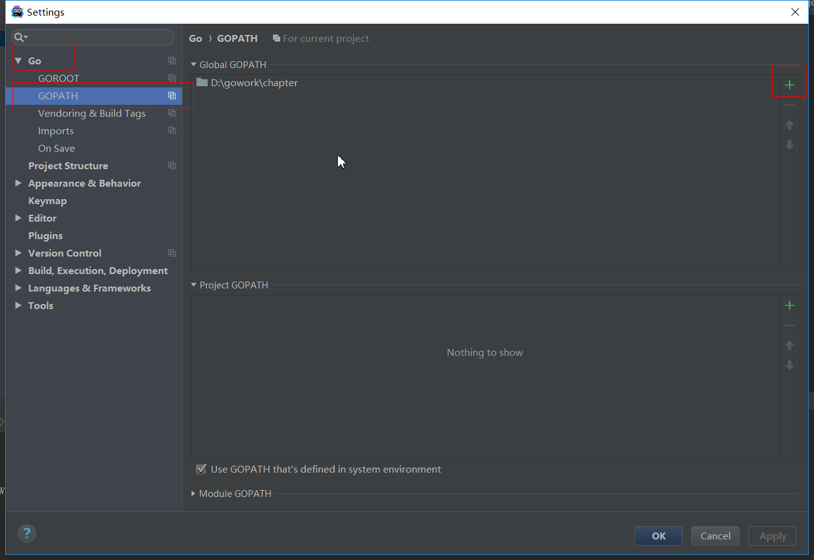
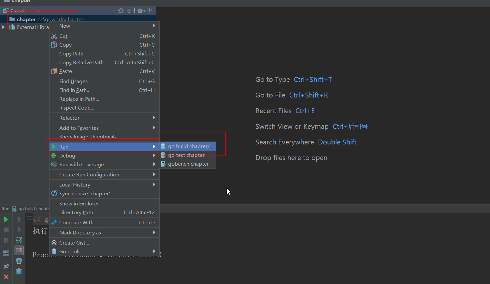

1、


# 一. 标准的项目结构

* 在实际开发中不可能只有一个main包,更不可能就只有一个.go文件.
* 不同级别大小的项目中包和文件数量都不同
* Go语言中组织单元最大的为项目,项目下包含包,一个包可以有多个文件
* 包在物理层面上就是文件夹.同一个文件夹中多个文件的package必须相同,一般package和所在文件夹名称相同
* 在Goland中创建标准Go项目
```
-- 项目名
	--src				//所有源代码都存放到这个文件
		--文件夹		  //文件夹一般为包名称
			--xx.go		//源码文件
			--mm.go		//源码文件
		--文件夹
			--xx.go
	--main.go			//主函数所在文件,名称任意,注意main.go在项目根目录
	--bin 存放小工具		
	--pkg 系统编译后生成的内容	//自动生成,不需要创建
```


# 二.Goland配置

* Go语言要求必须配置GOPATH环境变量.告诉系统项目的路径.
* Go语言在寻找包时会从GOPATH/src 路径中寻找包,如果不存在去GOROOT/src(Go语言标准库源码所在文件夹)下找
* Goland是集成开发环境,所以在GoLand中配置GOPATH即可.
* 点击菜单栏中"File" 中的 "Settings" 菜单项

* 在新弹出界面的 "Go"下面 "GOPATH",点击右侧"+"把当前项目路径设置进去

* 右键项目 --> Run --> go build 项目名 就可以运行项目
