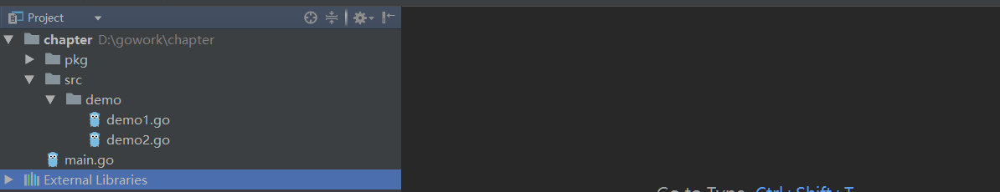

# 一. 包概述

* 包(package)是Go语言中组织单元.包是逻辑上的分组.而物理上的分组是不同的文件夹,文件夹和包一般是对应的
* 把多个文件放入同一个文件夹中,这些文件就是在同一个包中.
* 虽然允许源码文件的package和文件夹名不同但是最终编译后都会把文件的package编译成文件夹名称.所以为防止错误最好把文件的package和文件夹名称设置成相同的
* 一个Go语言项目必须要有main包,其他自定义名称的包个数任意,根据自己的需求即可.
* Go语言在寻找包时会从GOPATH/src 路径中寻找包,如果不存在去GOROOT/src(Go语言标准库源码所在文件夹)下找
* 不同包下资源可以相互访问,在导入其他包后,可以访问包下首字母大写的内容
* 同包下不同文件中全局资源可以随意访问

# 二.自定义包
* 新建项目后在项目下新建src文件夹,在src文件夹中新建demo文件
* 在demo文件中新建demo1.go和demo2.go文件
* demo1.go文件源码如下
```go
package demo//包为demo

import "fmt"

func demo1(){
	fmt.Println("执行demo1")
}
```
* demo2.go文件源码如下
```go
package demo//包为demo

import "fmt"

func Demo2()  {//函数名大写才能被其他包访问
	fmt.Println("执行demo2")
	demo1()//同包下内容任意访问
}
```
* 在项目根目录下新建main.go,源码如下
```go
package main

import "demo"

func main() {
	demo.Demo2()
}
```
* 运行整个项目后,发现可以正常调用Demo2()函数
* 整个程序目录结构如下
  