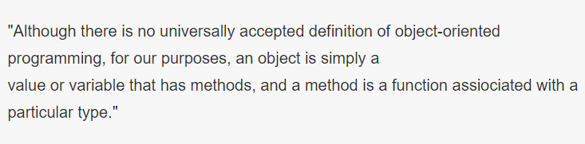

！！

1、Go语言中已经有函数了,又添加了对方法的支持，这是为什么？

​      答：主要是保证Go语言是面向对象的，**方法属于结构体**,通过结构体变量调用，一个结构体可以用来描述一个对象，里面包含对象的属性等等

2、方法和函数语法比较像,区别是**函数属于包**,通过包调用函数,而方法属于结构体,通过结构体变量调用

3、方法需要添加标识，而函数不需要（因为有默认机制）

```go
func (变量名 结构体类型) 方法名(参数列表) 返回值列表{
  //方法体
}			结构体的变量名就是方法的标识
```

4、方法的调用要注意的问题

```go
type People struct {
   Name string//姓名
   Weight float64//体重.单位斤
}

func (p People) run(){		//p People声明的是一个结构体变量，p *People声明的是一个 															//结构体指针		
   fmt.Printf("%p \n",&p)
   fmt.Println(p.Name,"正在跑步，体重为",p.Weight)
   p.Weight-=1
}

func main() {
   peo := People{"张三", 100}
   fmt.Printf("%p \n",&peo)
   peo.run()     //这里调用run相当于把peo传给p,但是peo是一个值(p={"张三“，100)，传过去						p的姓名体重如果变化，不会影响到peo
              	 //如果把p People变成p *People,那么p的姓名体重如果变化，会影响到peo
   fmt.Println("跑步后的体重为",peo.Weight)
}
```


# 一. 方法

* 方法和函数语法比较像,区别是函数属于包,通过包调用函数,而方法属于结构体,通过结构体变量调用
* 默认是函数,隶属于包,所以需要添加标识.告诉编译器这个方法属性哪个结构体
  * 调用方法时就把调用者赋值给接收者(下面的变量名就是接受者)
```go
func (变量名 结构体类型) 方法名(参数列表) 返回值列表{
  //方法体
}
```

* Go语言中已经有函数了,又添加了对方法的支持主要是保证Go语言是面向对象的.Go语言官方对面向对象的解释

  * 翻译如下:虽然面向对象没有统一的定义，但是对于我们来说对象仅仅是一个有着方法的值或变量,而方法就是一个属于特定类型的函数

  

* 从上面的解释可以看出,官方给出可明确说明,方法类似于函数.方法归属于特定类型

# 二.代码示例
* 定义一个People类型结构体,在对People结构体定义个run()方法
```go
type People struct {
	Name string//姓名
	Weight	float64//体重.单位斤
}

func (p People) run(){
	fmt.Println(p.Name,"正在跑步")
}

func main() {
	peo:=People{"张三",17}
	peo.run()
}
```
* 如果设定需求,在每次跑步后体重都减少0.1斤.上面代码就需要修改了.因为结构体是值类型,修改方法中结构体变量p的值,主函数中peo的值不会改变,因为传递的是值副本.所以修改方法中结构体类型为结构体指针类型就可以完成设定需求
```go
type People struct {
	Name string//姓名
	Weight	float64//体重.单位斤
}

func (p *People) run(){
	fmt.Println(p.Name,"正在跑步,体重为:",p.Weight)//输出:张三 正在跑步,体重为: 17
	p.Weight-=0.1
}

func main() {
	peo:=&People{"张三",17}
	peo.run()
	fmt.Println(peo.Name,"跑完步后的体重是",peo.Weight)//输出:张三 跑完步后的体重是 16.9
}
```
