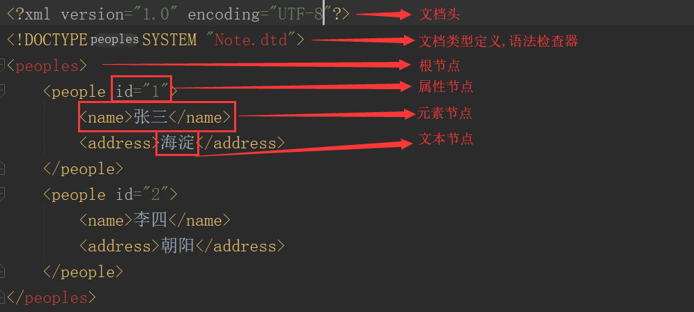
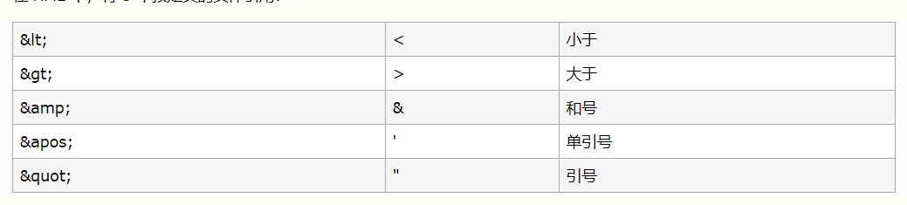

1、

- 英文全称:Extensible Markup Language
- 中文全称:可扩展标记语言

2、

- 数据存储			//数据持久化
- 数据交互                 //json,xml
- 配置文件  

3、语法要求

- 严格区分大小写
- 标签必须正确嵌套,必须正确关闭
- 必须有根节点
- 属性值必须有双引号
- 注释:`<!--  -->`
- 文本节点出现特殊字符,需要使用实体引用替换

# 一.XML文件简介

* 英文全称:Extensible Markup Language
* 中文全称:可扩展标记语言
* 用途:
  * 数据存储			//数据持久化
  * 数据交互                 //json,xml
  * 配置文件                  
* 优点:
  * 跨平台性
  * 数据工整,易读
# 二.XML文档结构
* XML文档结构
  * 第一行:XML头,版本和编码
  * 第二行:DTD可选,能够检查XML内容是否满足要求
  * 最外层标签`<peoples>` 称为元素节点,根节点
  * `<people>...<people>` 整个标签称为元素节点
  * id=”1” 属性节点e
  * 标签中文字:文本节点
* 示例如下
    
# 三.语法要求

* 严格区分大小写
* 标签必须正确嵌套,必须正确关闭
* 必须有根节点
* 属性值必须有双引号
* 注释:`<!--  -->`
* 文本节点出现特殊字符,需要使用实体引用替换
  

